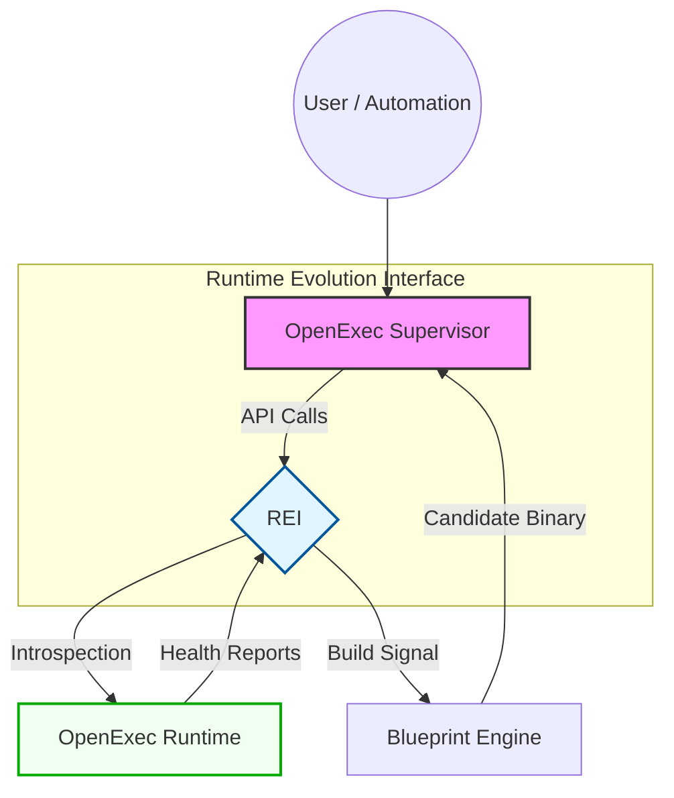

# OpenExec Runtime Evolution Interface (REI)

**Version:** v0.1  
**Status:** Architectural Extension (Future)

The Runtime Evolution Interface (REI) provides a clean boundary between the active runtime and future evolution workflows, such as upgrades, repairs, and experiments. It ensures that the runtime can participate in its own improvement without the risk of unsafe self-mutation.

## 1. Architectural Position
The REI sits as a control layer between the **OpenExec Supervisor** and the **OpenExec Runtime**.



## 2. Core Evolution Model
The system operates using three distinct runtime states: **Active**, **Candidate**, and **Previous**.
*   **Immutability:** Each runtime version is immutable once launched.
*   **Replacement Workflow:** Evolution occurs by replacing the active runtime with a validated candidate, never by mutating the live process in place.

## 3. The Evolution Lifecycle
1.  **Detect:** Runtime health signals (crashes, latency, policy anomalies) trigger a `RuntimeIncident`.
2.  **Diagnose:** The runtime collects `EvolutionContext` (logs, stack traces, reproduction runs).
3.  **Build:** A blueprint generates a **Candidate Runtime** in an isolated workspace (e.g., a separate git worktree).
4.  **Validate:** The candidate must pass unit tests, boot tests, and **Golden Run Replays**.
5.  **Promote/Reject:** The Supervisor promotes the candidate to Active or rejects it based on the `ValidationReport`.

## 4. The Interface (REI)
The runtime exposes a minimal API to the supervisor to facilitate this lifecycle:

```go
type RuntimeEvolutionInterface interface {
    // Periodically emitted to the supervisor
    ReportRuntimeHealth() RuntimeHealthReport

    // Gathers context after an incident is detected
    CollectEvolutionContext(incidentID string) EvolutionContext

    // Triggers the blueprint to build a new version
    BuildCandidateRuntime(ctx EvolutionContext) (CandidateRuntime, error)

    // Executes the validation suite in isolation
    ValidateCandidate(candidate CandidateRuntime) ValidationReport
}
```

## 5. Security & Stability
*   **No Delegated Authority:** The Supervisor always maintains promotion authority; the runtime cannot promote itself.
*   **Rollback Guarantee:** If a candidate fails to boot or exhibits degraded health during the observation window, the Supervisor restores the `Previous` version immediately.
*   **Isolation:** Candidate runtimes are restricted from interacting with the active runtime's state or the supervisor's memory space.

---
**Summary:** The REI introduces a controlled mechanism for runtime evolution, allowing OpenExec to support safe, autonomous self-improvement while preserving system stability.
