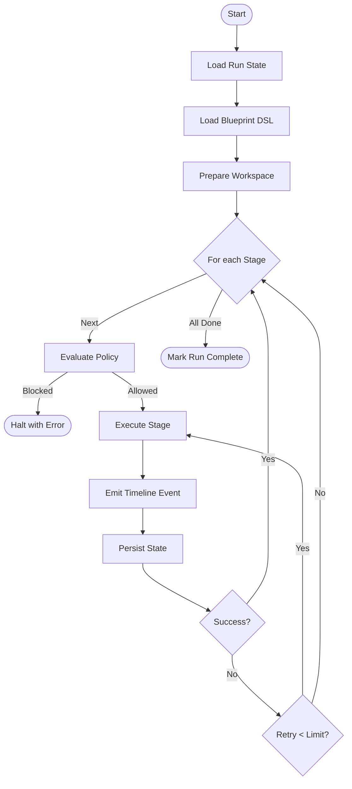

# OpenExec Runtime Loop (Reference Implementation)

This document defines the core logic that drives blueprint execution, policy enforcement, tool actions, and observability in OpenExec.

## 1. Core Idea
The runtime loop is the "kernel" of OpenExec. It only does five things:
1.  **Load Run** (current state)
2.  **Load Blueprint** (the plan)
3.  **Execute Stages** (delegated work)
4.  **Emit Events** (observability)
5.  **Persist State** (durability)

**Crucial Rule:** The runtime loop coordinates work but never contains the logic for git, models, tools, or tests itself.

## 2. High-Level Flow
`Load Run` → `Load Blueprint` → `For each Stage: (Policy Eval → Execute → Log → Persist)` → `Finish`.



## 3. Reference Implementation (Go)

```go
func (r *Runtime) ExecuteRun(ctx context.Context, runID string) error {
    run, _ := r.state.GetRun(runID)
    blueprint, _ := r.blueprints.Load(run.BlueprintID)
    workspace, _ := r.workspace.Prepare(run)

    for _, stage := range blueprint.Stages {
        r.events.Emit(Event{Type: "stage_started", RunID: runID, Stage: stage.ID})

        // 1. Policy Evaluation
        decision, _ := r.policy.Evaluate(stage.PolicyRequest())
        if decision.Blocked {
            return fmt.Errorf("policy blocked stage %s", stage.ID)
        }

        // 2. Delegated Execution
        result, err := r.executeStage(ctx, stage, workspace, run)

        r.events.Emit(Event{Type: "stage_completed", RunID: runID, Stage: stage.ID, Success: err == nil})

        // 3. Routing & Retry Logic
        if err != nil {
            if stage.Retry < blueprint.MaxRetry {
                stage.Retry++
                continue
            }
            return err // or follow blueprint.OnFailure
        }
    }
    return r.state.MarkRunComplete(runID)
}
```

### Stage Delegation
```go
func (r *Runtime) executeStage(ctx context.Context, stage Stage, ws Workspace, run *Run) (Result, error) {
    switch stage.Type {
    case DeterministicStage:
        action := r.actions.Get(stage.Action)
        return action.Execute(ctx, ActionRequest{Run: run, Workspace: ws})
    case AgentStage:
        contextPack := r.context.Build(run)
        response, _ := r.model.Generate(ctx, ModelRequest{Context: contextPack, Tools: stage.Toolset})
        return r.toolExecutor.Handle(response)
    default:
        return Result{}, fmt.Errorf("unknown stage type")
    }
}
```

## 4. What This Prevents
*   **No Hidden Workflow Logic:** Prompts cannot secretly decide what stage comes next.
*   **No Uncontrolled Tool Use:** Tools are strictly limited by toolsets and the policy engine.
*   **No Infinite Loops:** Retry caps are enforced deterministically by the Go runtime.
*   **No Opaque Agent Runs:** Every step produces a timeline event for full transparency.

## 5. Strategic Advantage
Most agent frameworks fail because the LLM loop decides everything, leading to unpredictability. OpenExec is a **deterministic runtime with bounded agent stages**, making it suitable for production automation where auditability and control are non-negotiable.

---
**Summary:** Protect the "Tiny Loop." If the core orchestration stays under 150 lines of Go, the system remains maintainable, debuggable, and secure.
