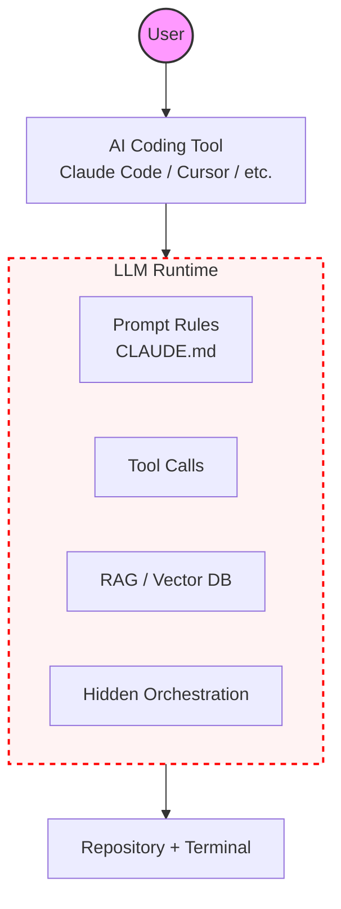
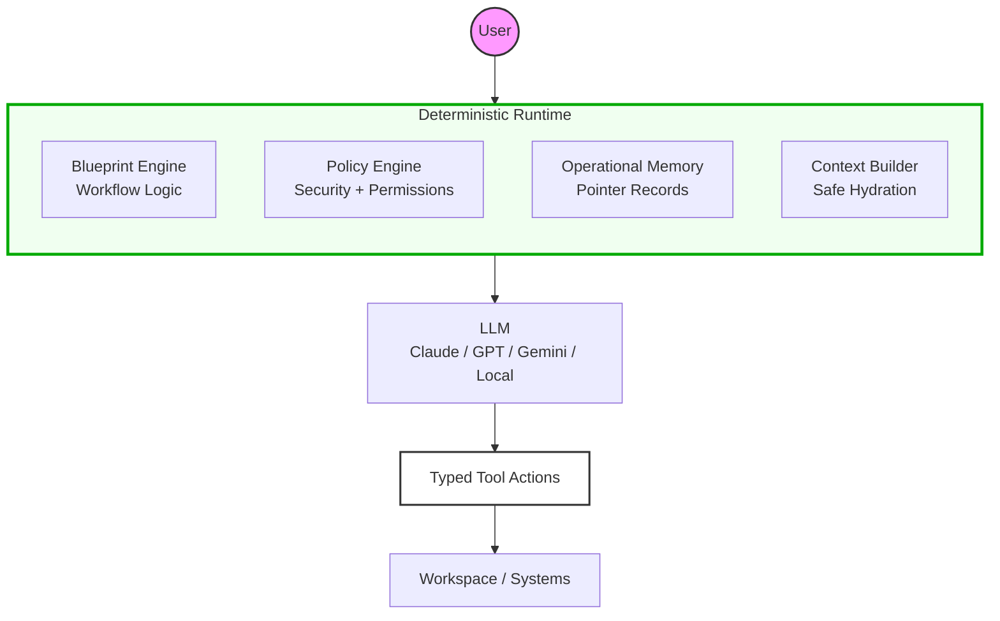

# The One Diagram That Explains OpenExec

To understand OpenExec, you must first understand the fundamental shift in how it handles the AI control plane compared to traditional tools like Claude Code, Cursor, or Codex.

## 1. How most AI coding tools work
In traditional tools, the LLM **is** the runtime. The system behavior depends on prompts, probabilistic retrieval, and hidden orchestration. Developers try to control it using `CLAUDE.md` or system prompts, but these are mere suggestions, not deterministic logic.

## 2. OpenExec Architecture
OpenExec flips the control plane. The runtime is deterministic and governed by code, while the LLM is treated as a **reasoning component** that helps inside strict boundaries.

## 3. The Difference in One Sentence
*   **Most tools:** The LLM decides what happens.
*   **OpenExec:** The Runtime decides what happens; the LLM helps reason inside enforced boundaries.

## 4. Why This Matters
*   **Enforcement vs. Suggestions:** In a prompt-based system, "always run tests" is a suggestion the model may ignore. In OpenExec, `run_tests` is a blueprint stage that **always** executes.
*   **Maintenance vs. Writing:** Traditional tools are optimized for writing new code. OpenExec is optimized for **maintaining real systems** because it combines operational memory with deterministic workflows.
*   **Model Portability:** OpenExec uses a model adapter layer. Switching from Claude to Gemini or a local model does not change your system logic or security policies.

## 5. The Mental Model
The easiest analogy for engineers is this:
*   **Claude Code : AI coding** = **Docker : containers**
*   **OpenExec : runtime orchestration** = **Kubernetes : containers**

OpenExec is the **runtime infrastructure** for AI-assisted engineering. Once you treat the LLM as a component in a larger system rather than the system itself, the architecture makes perfect sense.
