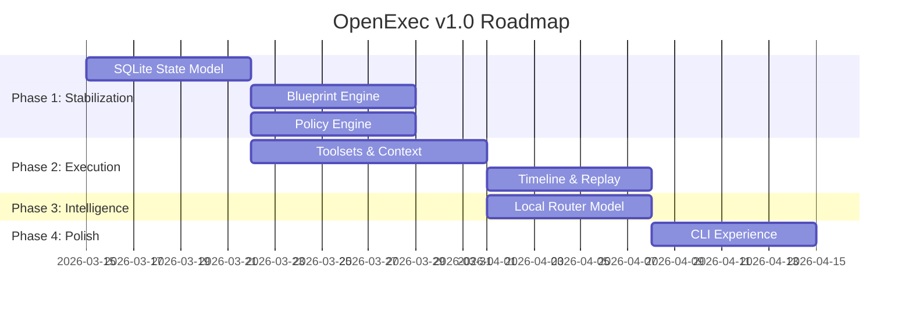

# OpenExec V1 Cut List & Migration Board

This board tracks the aggressive simplification of the OpenExec architecture. We classify every component into one of five categories to ensure a focused, deterministic v1 release.

## 1. DELETE (Immediate)
These create architecture bloat or conflicting execution models.

| Component | Problem | Replacement |
| :--- | :--- | :--- |
| **Legacy 5-Phase Pipeline** | Rely on prompt personas; duplicate Blueprint logic. | Blueprint DSL Engine. |
| **stories.json / tasks.json** | Shadow state systems; drift from SQLite. | Unified SQLite Schema. |
| **Prompt-controlled routing**| Hidden workflows in LLM logic. | Blueprint routing (code). |
| **"All tools exposed" model** | Tool hallucination and leakage risk. | Curated Toolsets. |
| **Shell-as-fallback** | Destroys determinism and replay. | Typed Tool Action Contracts. |

## 2. MIGRATE (Architecture Refactor)
Systems that are valuable but must align with the new core runtime.

*   **State → Unified SQLite Model:** Move all session, task, and run data into the canonical schema for deterministic recovery.
*   **Execution → Blueprint Engine:** Standardize all implementation flows on the Blueprint interpreter.
*   **Tool Invocation → Tool Action Contracts:** Standardize inputs/outputs for every capability (e.g., `apply_patch`).
*   **Safety → Policy Engine:** Centralize capability checks and sandbox mode enforcement.
*   **Context Assembly → Context Builder:** Move context packing into a dedicated deterministic subsystem.

## 3. FREEZE (Keep but stop expanding)
Features that are functional but not essential priorities for v1.

*   **Web UI:** Focus on CLI and terminal timeline output until the runtime is stable.
*   **Slack / Ticket Integrations:** Postpone until v2.
*   **MCP Ecosystem:** Stick to local tools; avoid building a "marketplace" yet.
*   **Multi-model Complexity:** Keep provider routing simple (Local Router → Main Model).

## 4. KEEP (Core Architecture)
The foundational strengths we are doubling down on.

*   **Blueprint Engine:** Deterministic workflow orchestration.
*   **Toolsets:** Enforced minimal context and safety boundaries.
*   **Policy Engine:** Sandbox modes, approval gates, and path restrictions.
*   **Local LLM Router:** Intent classification and privacy-aware selection.
*   **Run Timeline & Replay:** Full execution transparency and auditability.

## 5. DEFER (V2+)
Interesting ideas that are explicitly out of scope for v1.

*   Multi-agent swarms or complex delegation layers.
*   Distributed workers and remote execution pools.
*   Cron-like autonomous background agents.
*   Fully automated CI/PR generation.

---

## Implementation Roadmap

### Phase 1: Runtime Stabilization (1-2 Weeks)
*   Finalize SQLite state model and remove authoritative JSON state.
*   Stabilize the Blueprint Engine and Policy Engine.
*   Implement the first set of Tool Action Contracts.

### Phase 2: Deterministic Execution (1-2 Weeks)
*   Implement Toolsets and the Context Builder.
*   Add the Run Timeline and Replay mode.
*   Enforce explicit retry caps (e.g., `max_retry = 2`).

### Phase 3: Intelligence Layer (1 Week)
*   Integrate the Local Router model for toolset and context selection.
*   Finalize the Model Adapter layer.

### Phase 4: CLI Experience (1 Week)
*   Polish `openexec chat`, `run`, `show`, and `replay` commands.

---
**Strategic Result:** OpenExec becomes a deterministic AI coding runtime—reverting the industry trend of "opaque agents" back toward "structured engineering tools."
